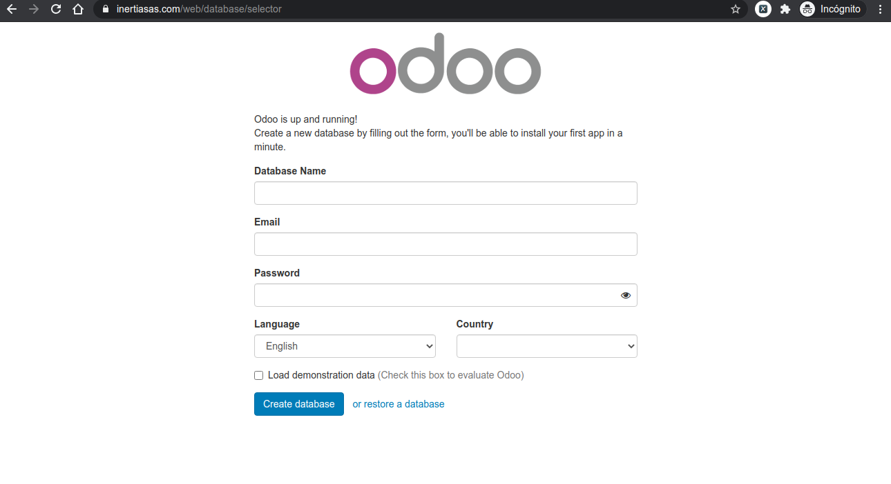

# Instalación de Odoo 10 en AWS Ubuntu 16.04

[TOC]

## 1 Prerrequisitos

### 1.1 Amazon Web Service

https://www.youtube.com/watch?v=VdXQTcetr6o

#### 1.1.1 Crear y activar una cuenta AWS

https://aws.amazon.com/es/premiumsupport/knowledge-center/create-and-activate-aws-account/

#### 1.1.2 Lanzar servidor AWS EC2 con Ubuntu 16.04

https://mobisoftinfotech.com/resources/mguide/launch-aws-ec2-server-set-ubuntu-16-04/

#####  1.1.2.1 Grupos de seguridad


#### 1.1.3 Conexión a la instancia

**Información de la instancia**

https://docs.aws.amazon.com/es_es/AWSEC2/latest/UserGuide/connection-prereqs.html#connection-prereqs-get-info-about-instance

**Conexión a la instancia de Linux mediante un cliente SSH**

https://docs.aws.amazon.com/es_es/AWSEC2/latest/UserGuide/AccessingInstancesLinux.html#AccessingInstancesLinuxSSHClient

```
ssh -i /path/my-key-pair.pem my-instance-user-name@my-instance-public-dns-name
```

**Ejemplo**

```
sudo ssh -i /home/luisca1985/Documentos/Inertia/aws_server/key_pair/inertiasas_aws_key_pair.pem ubuntu@ec2-3-129-68-98.us-east-2.compute.amazonaws.com
```

### 1.2 Dominio

https://www.palbin.com/knowledge-base/como-configurar-mi-dominio-en-godaddy/

https://co.godaddy.com/help/configuracion-de-dns-para-tu-dominio-de-cpanel-8852


## 2 Instalación

https://www.vultr.com/docs/installing-odoo-10-community-on-ubuntu-16-04

https://www.rosehosting.com/blog/how-to-install-odoo-10-on-ubuntu-16-04-with-nginx-as-a-reverse-proxy/

### 2.1 Ingresar, actualizar y cerrar

#### 2.1.1 Abrir la conexión con la instancia

```
ssh -i /path/my-key-pair.pem my-instance-user-name@my-instance-public-dns-name
```

#### 2.1.2 Actualizar el sistema

Antes de instalar cualquier paquete en su instancia de Ubuntu, inicie sesión con el usuario `sudo` y actualice.

```
sudo apt-get update
sudo apt-get upgrade
```

#### 2.1.3 Cerrar la conexión con la instancia

```
sudo reboot
```

Una vez que el sistema se haya reiniciado, inicie sesión nuevamente como usuario `sudo` y continúe con los siguientes pasos.

### 2.2 Agregar el repositorio de paquetes de Odoo

Ejecute los siguientes comandos como root:

```
sudo su
```

```
wget -O - https://nightly.odoo.com/odoo.key | apt-key add -
echo "deb http://nightly.odoo.com/10.0/nightly/deb/ ./" >> /etc/apt/sources.list.d/odoo.list
apt-get update
```

### 2.3 Instalación PostgreSQL 9.5 en Ubuntu 16.04

https://www.calhoun.io/how-to-install-postgresql-9-5-on-ubuntu-16-04/

```
sudo apt-get update
sudo apt-get install postgresql postgresql-contrib
```

```
sudo systemctl start postgresql
sudo systemctl enable postgresql
```

```
sudo systemctl status odoo
```

Se crea un usuario PostgreSQL con los siguientes comandos:

```
sudo su - postgres
createuser odoo -U postgres -dRSP
```

Cuando se le solicite, establezca una contraseña segura para el usuario de la base de datos y guárdela en un lugar seguro.

```
exit
```

### 2.4 Instalar Odoo

```
sudo apt-get install odoo
```

Inicie Odoo y configúrelo para que se inicie automáticamente cuando se inicie el sistema.

```
sudo systemctl start odoo
sudo systemctl enable odoo
```

### 2.5 Instale Nginx para facilitar el acceso del usuario

https://www.youtube.com/watch?v=7bHSUCKt3SE

Puede redirigir el tráfico en el puerto HTTP predeterminado (80) y el puerto HTTPS predeterminado (443) a Odoo (que se ejecuta en el puerto 8069) para que los usuarios ya no tengan que agregar el número de puerto 8069 cada vez que acceden al sistema.

```
sudo apt-get install nginx
```

Edite el archivo de configuración del sitio Nginx utilizando un editor de texto, como nano.

```
sudo su
```

```
nano /etc/nginx/sites-available/default
```

Encuentra las siguientes líneas.

```
        location / {
                # First attempt to serve request as file, then
                # as directory, then fall back to displaying a 404.
                try_files $uri $uri/ =404;
        }
```

Y cambialo por los siguiente:

```
        #location / {
                # First attempt to serve request as file, then
                # as directory, then fall back to displaying a 404.
                # try_files $uri $uri/ =404;
        #}

        # PORT 8069 to PORT 80

        location / {
             proxy_pass http://localhost:8069;
             proxy_http_version 1.1;
             proxy_set_header Upgrade $http_upgrade;
             proxy_set_header Connection 'upgrade';
             proxy_set_header Host $host;
             proxy_cache_bypass $http_upgrade;
         }
```

Reinicie Nginx y configúrelo para que se inicie automáticamente cuando se inicie el sistema.

```
systemctl restart nginx
systemctl start nginx
```

Ahora puede visitar el sistema Odoo desde el puerto 8069 y el puerto 80.

```
http://[your-vultr-instance-IP]:8069
http://[your-vultr-instance-IP]
```

### 2.6 Certificado SSL con Let’s Encrypt

https://clouding.io/hc/es/articles/360010373220-Configurar-SSL-en-la-imagen-de-Odoo

https://www.youtube.com/watch?v=7bHSUCKt3SE

#### 2.6.1 Instalación de Let’s Encrypt

Agregamos el repositorio y los actualizamos:

```
sudo su
add-apt-repository ppa:certbot/certbot
apt-get update
```

Y luego lo instalamos:

```
apt install python-certbot-nginx
```

Ajustamos el archico Nginx

```
nano /etc/nginx/sites-available/default
```

en `server_name` se incluye el dominio

```
server_name inertiasas.com www.inertiasas.com;
```

Guardamos y reiniciamos el servicio Nginx:

```
systemctl restart nginx
```

Activamos el firewall ufw:

```
ufw allow 'Nginx Full'
ufw allow 'OpenSSH'
ufw enable
```

Verificamos el estado de ufw:

```
ufw status
```

Lo cual debe retornar

```
To                         Action      From
--                         ------      ----
Nginx Full                 ALLOW       Anywhere                  
OpenSSH                    ALLOW       Anywhere                  
Nginx Full (v6)            ALLOW       Anywhere (v6)             
OpenSSH (v6)               ALLOW       Anywhere (v6) 
```

Generamos el certificado:

```
certbot --nginx -d inertiasas.com -d www.inertiasas.com
```

Las respuestas son las siguientes

```
Plugins selected: Authenticator nginx, Installer nginx
Enter email address (used for urgent renewal and security notices) (Enter 'c' to
cancel): luisca1985@gmail.com
```

```
- - - - - - - - - - - - - - - - - - - - - - - - - - - - - - - - - - - - - - - -
Please read the Terms of Service at
https://letsencrypt.org/documents/LE-SA-v1.2-November-15-2017.pdf. You must
agree in order to register with the ACME server at
https://acme-v02.api.letsencrypt.org/directory
- - - - - - - - - - - - - - - - - - - - - - - - - - - - - - - - - - - - - - - -
(A)gree/(C)ancel: A
```

```
- - - - - - - - - - - - - - - - - - - - - - - - - - - - - - - - - - - - - - - -
Would you be willing to share your email address with the Electronic Frontier
Foundation, a founding partner of the Let's Encrypt project and the non-profit
organization that develops Certbot? We'd like to send you email about our work
encrypting the web, EFF news, campaigns, and ways to support digital freedom.
- - - - - - - - - - - - - - - - - - - - - - - - - - - - - - - - - - - - - - - -
(Y)es/(N)o: N
```

```
Please choose whether or not to redirect HTTP traffic to HTTPS, removing HTTP access.
- - - - - - - - - - - - - - - - - - - - - - - - - - - - - - - - - - - - - - - -
1: No redirect - Make no further changes to the webserver configuration.
2: Redirect - Make all requests redirect to secure HTTPS access. Choose this for
new sites, or if you're confident your site works on HTTPS. You can undo this
change by editing your web server's configuration.
- - - - - - - - - - - - - - - - - - - - - - - - - - - - - - - - - - - - - - - -
Select the appropriate number [1-2] then [enter] (press 'c' to cancel): 2
```

El mensaje final es:

```
IMPORTANT NOTES:
 - Congratulations! Your certificate and chain have been saved at:
   /etc/letsencrypt/live/inertiasas.com/fullchain.pem
   Your key file has been saved at:
   /etc/letsencrypt/live/inertiasas.com/privkey.pem
   Your cert will expire on 2020-11-05. To obtain a new or tweaked
   version of this certificate in the future, simply run certbot again
   with the "certonly" option. To non-interactively renew *all* of
   your certificates, run "certbot renew"
 - Your account credentials have been saved in your Certbot
   configuration directory at /etc/letsencrypt. You should make a
   secure backup of this folder now. This configuration directory will
   also contain certificates and private keys obtained by Certbot so
   making regular backups of this folder is ideal.
 - If you like Certbot, please consider supporting our work by:

   Donating to ISRG / Let's Encrypt:   https://letsencrypt.org/donate
   Donating to EFF:                    https://eff.org/donate-le
```

### 2.7 Resultado de la instalación



## 3 Ajustes

### 3.1 Configurar Odoo

Ahora puede acceder a Odoo usando su navegador.

```
https://[your-vultr-instance-IP]
```

Elija un nombre para la base de datos que creará Odoo, ingrese su dirección de correo electrónico y elija una contraseña para el usuario `admin`. continúe haciendo clic en el botón `Create database`.

Una vez que se haya configurado la base de datos, accederá a la interfaz de usuario de Odoo, donde puede personalizar su sistema Odoo instalando aplicaciones.

## 4 Contructor de sitios web

https://www.youtube.com/watch?v=XxgRcFRqcAE

- Configuración -> Usuarios -> Compañias
  - Nombre de la compañía
  - Logo
  - Lema

- Administración del sitio web -> Configuración
  - Nombre del sitio
  - Idioma
  - Favicon
  - Medios sociales
    - Cuenta de Twitter
    - Cuenta de Facebook
    - Cuenta GitHub
    - Cuenta LinkedIn
    - Cuenta de Youtube
    - Cuenta Google+
- Sitio web -> Personalizar -> Editor HTML -> ID plantilla: website.layout_footer_copyright
  - Agregar año del copyright
  - Eliminar "Create a free website with Odoo"
- Curso interno de Odoo. Módulo del Sitio web
  - Temas (diseño front end)

### 4.1 Instalación del módulo

https://www.youtube.com/watch?v=DiWw0PSy9aI