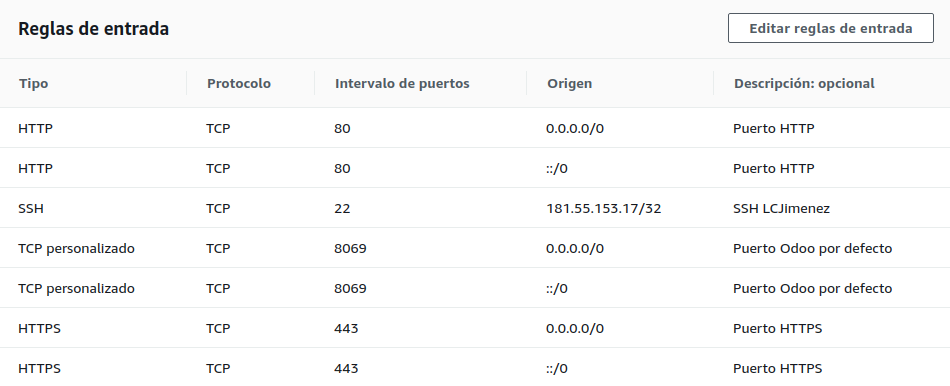

[TOC]

## Prerrequisitos

### Amazon Web Service

https://www.youtube.com/watch?v=VdXQTcetr6o

#### Crear y activar una cuenta AWS

https://aws.amazon.com/es/premiumsupport/knowledge-center/create-and-activate-aws-account/

#### Lanzar servidor AWS EC2 con Ubuntu 16.04

https://mobisoftinfotech.com/resources/mguide/launch-aws-ec2-server-set-ubuntu-16-04/

#####  Grupos de seguridad



#### Conexión a la instancia

**Información de la instancia**

https://docs.aws.amazon.com/es_es/AWSEC2/latest/UserGuide/connection-prereqs.html#connection-prereqs-get-info-about-instance

**Conexión a la instancia de Linux mediante un cliente SSH**

https://docs.aws.amazon.com/es_es/AWSEC2/latest/UserGuide/AccessingInstancesLinux.html#AccessingInstancesLinuxSSHClient

```
ssh -i /path/my-key-pair.pem my-instance-user-name@my-instance-public-dns-name
```

**Ejemplo**

```
sudo ssh -i /home/luisca1985/Documentos/Inertia/aws_server/key_pair/inertiasas_aws_key_pair.pem ubuntu@ec2-3-129-68-98.us-east-2.compute.amazonaws.com
```

### Dominio

https://www.palbin.com/knowledge-base/como-configurar-mi-dominio-en-godaddy/

https://co.godaddy.com/help/configuracion-de-dns-para-tu-dominio-de-cpanel-8852


