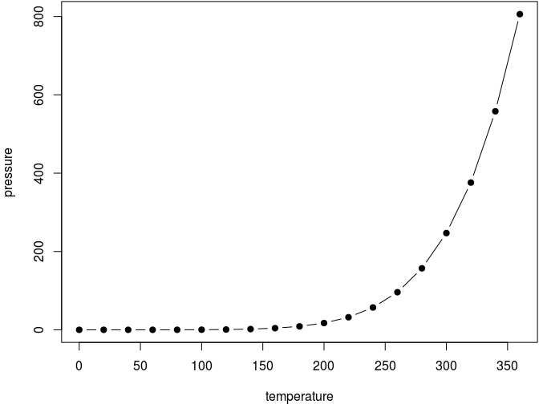

--- 
title: "Odoo AWS"
author: "Luis Camilo Jimenez Alvarez"
date: "2020-08-06"
site: bookdown::bookdown_site
documentclass: book
bibliography: [book.bib, packages.bib]
biblio-style: apalike
link-citations: yes
description: "Odoo en AWS."
---

# Prerrequisitos

## Amazon Web Service

### Crear y activar una cuenta AWS
https://aws.amazon.com/es/premiumsupport/knowledge-center/create-and-activate-aws-account/

### Lanzar servidor AWS EC2 con Ubuntu 16.04
https://mobisoftinfotech.com/resources/mguide/launch-aws-ec2-server-set-ubuntu-16-04/

### Conexión a la instancia

**Información de la instancia**
https://docs.aws.amazon.com/es_es/AWSEC2/latest/UserGuide/connection-prereqs.html#connection-prereqs-get-info-about-instance

**Conexión a la instancia de Linux mediante un cliente SSH**
https://docs.aws.amazon.com/es_es/AWSEC2/latest/UserGuide/AccessingInstancesLinux.html#AccessingInstancesLinuxSSHClient


```r
ssh -i /path/my-key-pair.pem my-instance-user-name@my-instance-public-dns-name
```

**Ejemplo**


```r
sudo ssh -i /home/luisca1985/Documentos/Inertia/aws_server/key_pair/inertiasas_aws_key_pair.pem ubuntu@ec2-3-129-68-98.us-east-2.compute.amazonaws.com
```

<!--chapter:end:index.Rmd-->

# Introduction {#intro}

You can label chapter and section titles using `{#label}` after them, e.g., we can reference Chapter \@ref(intro). If you do not manually label them, there will be automatic labels anyway, e.g., Chapter \@ref(methods).

Figures and tables with captions will be placed in `figure` and `table` environments, respectively.


```r
par(mar = c(4, 4, .1, .1))
plot(pressure, type = 'b', pch = 19)
```

<div class="figure" style="text-align: center">

<p class="caption">(\#fig:nice-fig)Here is a nice figure!</p>
</div>

Reference a figure by its code chunk label with the `fig:` prefix, e.g., see Figure \@ref(fig:nice-fig). Similarly, you can reference tables generated from `knitr::kable()`, e.g., see Table \@ref(tab:nice-tab).


```r
knitr::kable(
  head(iris, 20), caption = 'Here is a nice table!',
  booktabs = TRUE
)
```


Table: (\#tab:nice-tab)Here is a nice table!

| Sepal.Length| Sepal.Width| Petal.Length| Petal.Width|Species |
|------------:|-----------:|------------:|-----------:|:-------|
|          5.1|         3.5|          1.4|         0.2|setosa  |
|          4.9|         3.0|          1.4|         0.2|setosa  |
|          4.7|         3.2|          1.3|         0.2|setosa  |
|          4.6|         3.1|          1.5|         0.2|setosa  |
|          5.0|         3.6|          1.4|         0.2|setosa  |
|          5.4|         3.9|          1.7|         0.4|setosa  |
|          4.6|         3.4|          1.4|         0.3|setosa  |
|          5.0|         3.4|          1.5|         0.2|setosa  |
|          4.4|         2.9|          1.4|         0.2|setosa  |
|          4.9|         3.1|          1.5|         0.1|setosa  |
|          5.4|         3.7|          1.5|         0.2|setosa  |
|          4.8|         3.4|          1.6|         0.2|setosa  |
|          4.8|         3.0|          1.4|         0.1|setosa  |
|          4.3|         3.0|          1.1|         0.1|setosa  |
|          5.8|         4.0|          1.2|         0.2|setosa  |
|          5.7|         4.4|          1.5|         0.4|setosa  |
|          5.4|         3.9|          1.3|         0.4|setosa  |
|          5.1|         3.5|          1.4|         0.3|setosa  |
|          5.7|         3.8|          1.7|         0.3|setosa  |
|          5.1|         3.8|          1.5|         0.3|setosa  |

You can write citations, too. For example, we are using the **bookdown** package [@R-bookdown] in this sample book, which was built on top of R Markdown and **knitr** [@xie2015].

<!--chapter:end:01-intro.Rmd-->

# Literature

Here is a review of existing methods.

<!--chapter:end:02-literature.Rmd-->

# Methods

We describe our methods in this chapter.

<!--chapter:end:03-method.Rmd-->

# Applications

Some _significant_ applications are demonstrated in this chapter.

## Example one

## Example two

<!--chapter:end:04-application.Rmd-->

# Final Words

We have finished a nice book.

<!--chapter:end:05-summary.Rmd-->


# References {-}


<!--chapter:end:06-references.Rmd-->

